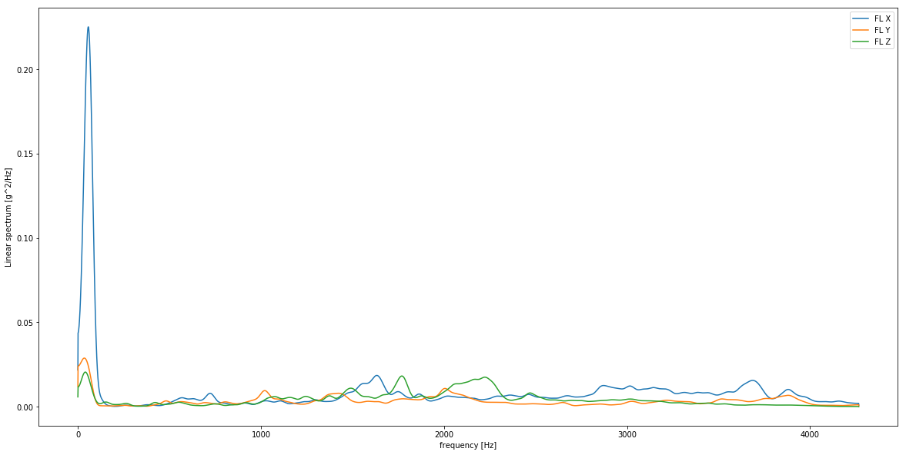
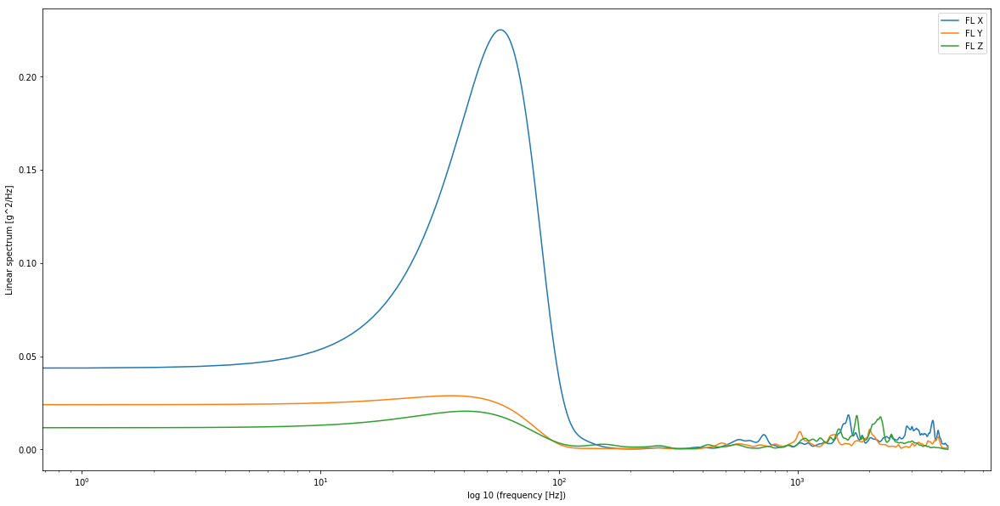
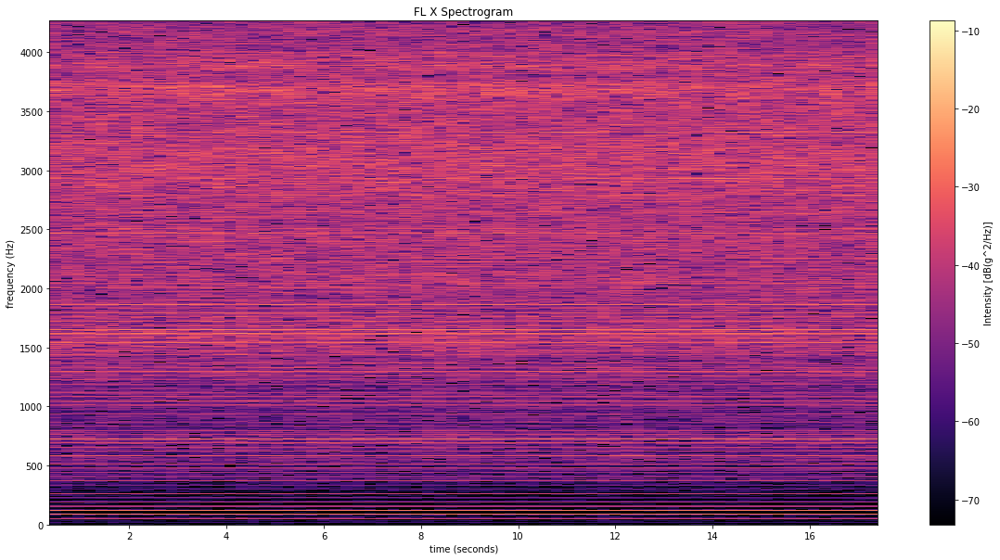
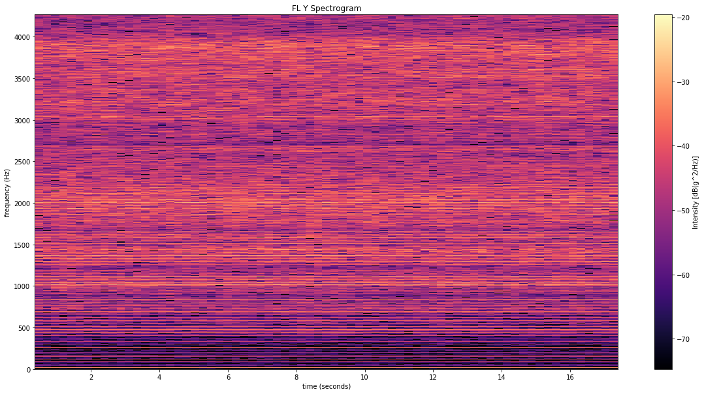
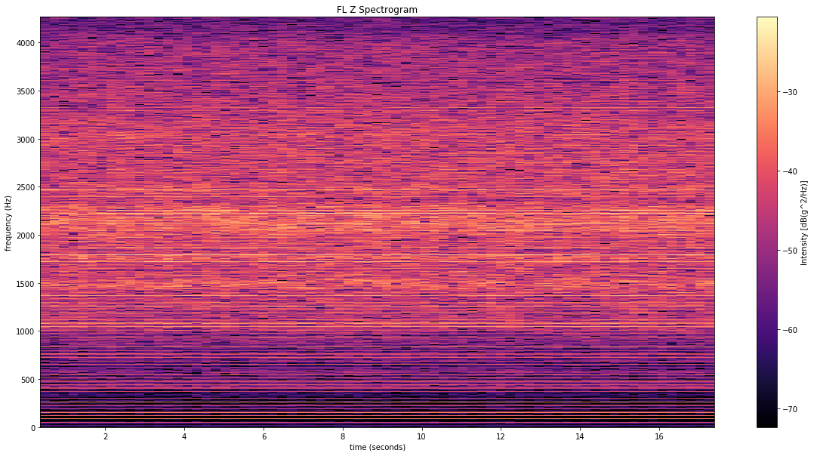

# AZ Vibration Review 


```python
import math
import numpy as np

from nptdms import tdms

import matplotlib.pyplot as plt

from acoustics import Signal
from acoustics.standards.iec_61672_1_2013 import (
    NOMINAL_OCTAVE_CENTER_FREQUENCIES,
    NOMINAL_THIRD_OCTAVE_CENTER_FREQUENCIES)

import scipy.fftpack
from scipy import integrate
import scipy.signal as signal

import scripts.sig as sig
from vib_files import getTdmsFilesInPath

%matplotlib inline
```

### Path to TDMS file and Appropriate Limits:


```python
#Find all vibration files in this path
mypath = './TDMS/'
result = getTdmsFilesInPath(mypath)
print ('{0} files found\n'.format(len(result)))
```

    3 files found
    
    


```python
[print(filename) for filename in result]
print()
```

    ./TDMS/Vibration Log_2019-05-09 - 113638.tdms
    ./TDMS/Vibration Log_2019-05-09 - 113732.tdms
    ./TDMS/Vibration Log_2019-05-09 - 143431.tdms
    
    


```python
#fn = <META_FILENAME>  #uncomment to get a scriptable choice
fn = result[0]
print(fn)
```

    ./TDMS/Vibration Log_2019-05-09 - 113638.tdms
    


```python
tdmspath = fn
#print(getlimitfrompath(fn))

#lim = getlimitfrompath(fn)
tdfile = tdms.TdmsFile(tdmspath)

#df = tdfile.as_dataframe()
#df.plot(figsize=(15,24), color=('r'), subplots=True );
```


```python
tdfile.object().properties
```


    OrderedDict([('DSA Hdw', 'NI-9234'),
                 ('Date', '2019-05-09'),
                 ('Title', 'DISTek'),
                 ('After Test Comments', ''),
                 ('Test Location', '*****'),
                 ('Test Operator', 'PR'),
                 ('Test Comments',
                  '1ST RUN FL ENGINE MOUNT ONLY\nY PARALELL TO CRANK')])


```python
for g in tdfile.groups():
    print(g)
    print(tdfile.object(g).properties)
    print('******************************************')
    for c in tdfile.group_channels(g):
        print(c.properties)
    print('------------------------------------------')
```

    Vibration
    OrderedDict([('Sample Rate', 8533.333333333334), ('Chn Coupling', 'IEPE AC Coupled')])
    ******************************************
    OrderedDict([('Sensor Sensitivity (mV/EU)', '10.02'), ('Engineering Units', 'g'), ('dB Reference (EU)', '1.00E+0'), ('Custom Label', 'EU'), ('Weighting Filter', 'Linear'), ('Pregain (dB)', '0.00'), ('Sensor SN', '12393X - X Axis'), ('Sensor Cal Date', '9/11/2015'), ('Sensor Cal Due', '9/11/2017'), ('wf_start_time', datetime.datetime(2019, 5, 9, 18, 36, 36, 53063, tzinfo=<UTC>)), ('wf_start_offset', 0.0), ('wf_increment', 0.00011718750000000002), ('wf_samples', 8533), ('Group', 'Vibration'), ('NI_ChannelName', 'FL X'), ('NI_UnitDescription', 'V'), ('unit_string', 'V')])
    OrderedDict([('Sensor Sensitivity (mV/EU)', '10.12'), ('Engineering Units', 'g'), ('dB Reference (EU)', '1.00E+0'), ('Custom Label', 'EU'), ('Weighting Filter', 'Linear'), ('Pregain (dB)', '0.00'), ('Sensor SN', '12393Y - Y Axis'), ('Sensor Cal Date', '9/11/2015'), ('Sensor Cal Due', '9/11/2017'), ('wf_start_time', datetime.datetime(2019, 5, 9, 18, 36, 36, 53063, tzinfo=<UTC>)), ('wf_start_offset', 0.0), ('wf_increment', 0.00011718750000000002), ('wf_samples', 8533), ('Group', 'Vibration'), ('NI_ChannelName', 'FL Y'), ('NI_UnitDescription', 'V'), ('unit_string', 'V')])
    OrderedDict([('Sensor Sensitivity (mV/EU)', '10.15'), ('Engineering Units', 'g'), ('dB Reference (EU)', '1.00E+0'), ('Custom Label', 'EU'), ('Weighting Filter', 'Linear'), ('Pregain (dB)', '0.00'), ('Sensor SN', '12393Z - Z Axis'), ('Sensor Cal Date', '9/11/2015'), ('Sensor Cal Due', '9/11/2017'), ('wf_start_time', datetime.datetime(2019, 5, 9, 18, 36, 36, 53063, tzinfo=<UTC>)), ('wf_start_offset', 0.0), ('wf_increment', 0.00011718750000000002), ('wf_samples', 8533), ('Group', 'Vibration'), ('NI_ChannelName', 'FL Z'), ('NI_UnitDescription', 'V'), ('unit_string', 'V')])
    ------------------------------------------
    Tach
    OrderedDict([('Pulses Per Rev', 1), ('Counter Timebase', '13.1072 MHz')])
    ******************************************
    OrderedDict()
    ------------------------------------------
    

### Plot overall Run


```python
win = np.hanning(8192)

class Axis():
    pass

axis = Axis()
axis.Name = []
axis.f = []
axis.Pxx = []
axis.dBPxx = []

for channel in tdfile.group_channels('Vibration'):
    #Get Metadata from tdms channel
    chName = (channel.properties['NI_ChannelName'])
    Sensitivity = float(channel.properties['Sensor Sensitivity (mV/EU)'])
    data = (channel.data * 1000 / Sensitivity)
    axis.Name.append(chName)
   
    #generate PSD using Welch's method
    f, Pxx_spec = signal.welch(data, fs=8533, window='hann', nfft=8192, detrend=None, scaling='spectrum')
    axis.f.append(f)
    axis.Pxx.append(Pxx_spec)
    axis.dBPxx.append(10*np.log10(Pxx_spec))
    

#PLOT LINEAR PSD    
fig, ax = plt.subplots()
fig.set_size_inches(20,10)

for i in range(0, 3):
    ax.plot(axis.f[i], axis.Pxx[i], label=axis.Name[i])
    
    #Area under g^2 / Hz Pxx curve is g^2 RMS, f[i] is frequency in Hz
    #Using trapezoid rule to numerically integrate area under curve, square root, and round to 2 places for g RMS data
    print(f'{axis.Name[i]}: {round(math.sqrt(integrate.trapz(axis.Pxx[i], x=axis.f[i])),2)} g RMS; 4kHz bandpass')

plt.xlabel('frequency [Hz]')
plt.ylabel('Linear spectrum [g^2/Hz]')
#plt.xlim(xmin=16)
plt.legend()
plt.show()


#PLOT LOG(x) PSD
fig, ax = plt.subplots()
fig.set_size_inches(20,10)

for i in range(0, 3):
    ax.semilogx(axis.f[i], axis.Pxx[i], label=axis.Name[i])
plt.xlabel('log 10 (frequency [Hz])')
plt.ylabel('Linear spectrum [g^2/Hz]')
plt.legend()
plt.show()
```

    C:\work\Anaconda3\lib\site-packages\mkl_fft\_numpy_fft.py:331: FutureWarning: Using a non-tuple sequence for multidimensional indexing is deprecated; use `arr[tuple(seq)]` instead of `arr[seq]`. In the future this will be interpreted as an array index, `arr[np.array(seq)]`, which will result either in an error or a different result.
      output = mkl_fft.rfft_numpy(a, n=n, axis=axis)
    

    FL X: 6.26 g RMS; 4kHz bandpass
    FL Y: 3.88 g RMS; 4kHz bandpass
    FL Z: 4.38 g RMS; 4kHz bandpass
    








```python
for channel in tdfile.group_channels('Vibration'):
    chName = (channel.properties['NI_ChannelName'])
    DOCSensitivity = float(channel.properties['Sensor Sensitivity (mV/EU)'])
    data = (channel.data * 1000 / DOCSensitivity)
    
    fig, ax = plt.subplots()
    fig.set_size_inches(20,10)
    
    ax.set_title(chName + ' Spectrogram')
    ax.set_xlabel('time (seconds)')
    ax.set_ylabel('frequency (Hz)')
    
    NFFT = 8192
    cmap = plt.get_cmap('magma')
    vmin = 10*np.log10(np.max(data)) - 80 #clamp to -80 dB
    cmap.set_under(color='k', alpha=None)
    
    pxx, freq, t, cax = plt.specgram(data, NFFT=NFFT, Fs=8533.3333, Fc=None, 
                                     detrend=None, window=np.hanning(8192), mode='psd',  
                                     noverlap=NFFT*0.75, pad_to=None, cmap=cmap, vmin=vmin, scale='dB')
    fig.colorbar(cax).set_label('Intensity [dB(g^2/Hz)]')
    
    plt.show()
    rmsData = math.sqrt(sum(data*data)/len(data))
```










